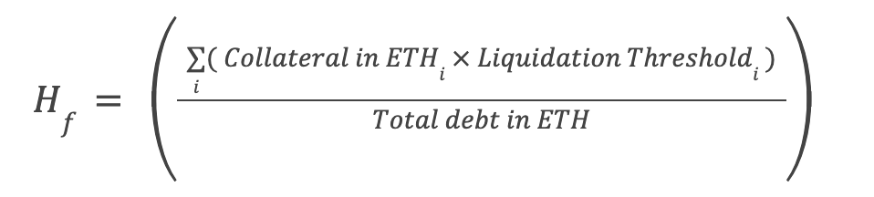

# Borrowing and Risk Parameters

Lucidly Finance offers dynamic interest rate loans aiming to be the most capital-efficient borrowing protocol. A user who needs liquid funds can use the protocol to lock up multiple assets listed on the protocol to borrow against the collateral and withdraw uLCD, which could be repaid at any future date.

Users can deposit multiple assets and borrow a certain amount of uLCD tokens. 
Each collateral has a certain LTV ratio (loan-to-value).

Each Vault has a single owner(can be an EOA or a contract) and a health factor that determines how much risk the owner assumes.

Any position that is under water and is eligible for liquidation if the health factor reached the liquidation threshold.